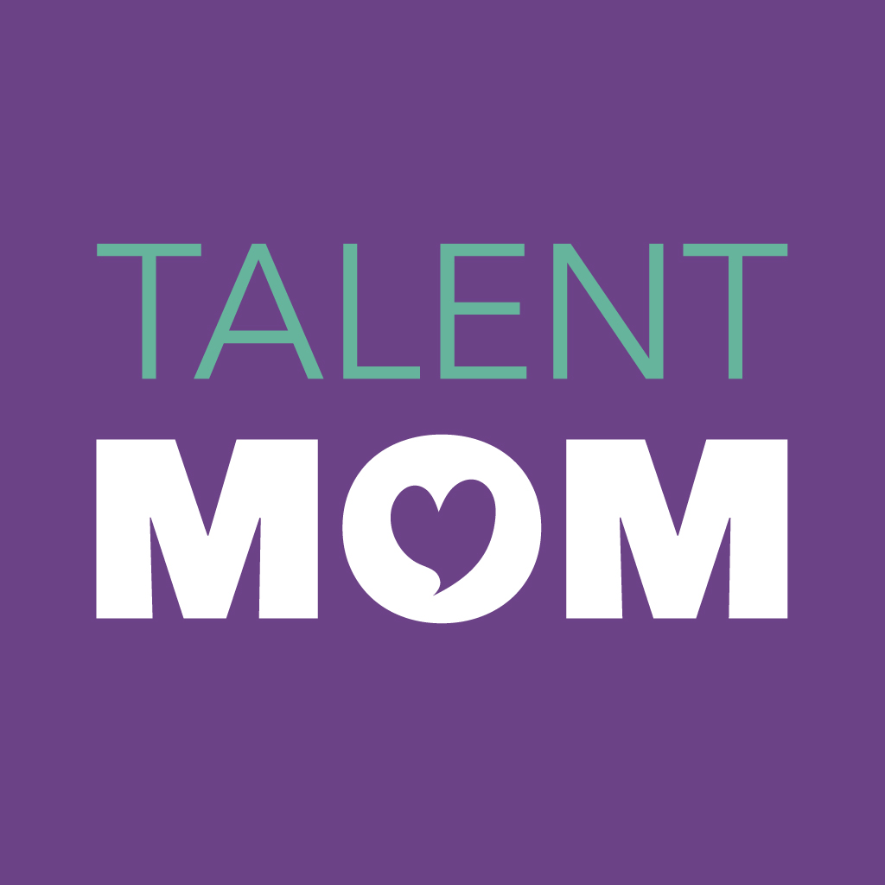
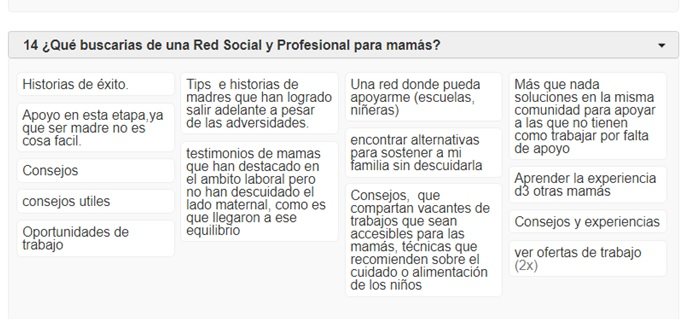
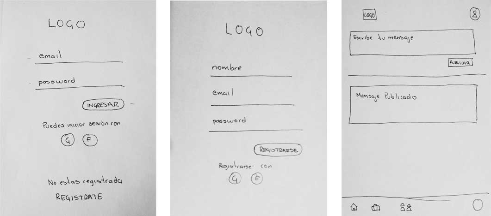

# TalentMOM
## Creando una Red Social

### Análisis Benchmark

Realizamos un anális competitivo con 2 redes sociales profesionales, LinkedIn de alcance global y dirigido a todo público y Womenalia, enfocada en el nicho de mercado al que nosotras nos queremos dirigir 

# Análisis argumentativo de la elección de la red social

En México existe un gran número de mamás digitales que tienen en común ser profesionistas, emprendedoras, innovadoras, creativas, sensibles y comprometidas hacia diversas causas sociales y se mantienen en constante crecimiento.
El 67.3% de la población femenina en México son madres, de acuerdo a datos del INEGI (2017). En su mayoría es una población joven perteneciente a la generación Millenial.
De acuerdo al estudio de Mamás Digitales Millenials de MOMSdata.com 
> “En relación a su vida familiar se destaca que el 82% vive en pareja, tanto en unión libre como en matrimonio. El 67% de estas madres tiene un solo hijo y 71% tiene hijos con edades comprendidas entre 0-3 años”

## Apuestan por su educación y desarrollo personal
Las mamás digitales millenial están interesadas en su educación y desarrollo profesional, de acuerdo a MOMSdata.com 
> “Encontramos que el 91% de las mamás digitales millennials mexicanas cuenta con al menos educación técnica media en adelante y el grado académico, incluso puede incrementarse con el paso del tiempo. La mitad de las madres ya alcanzó el nivel universitario. Sin embargo, la escolaridad no se ve reflejada en ingresos, 67% de nuestras millennial moms tienen entradas monetarias por debajo de los 10,000 pesos, este rango de los niveles de ingresos más bajos, está 17 puntos porcentuales por encima de las madres pertenecientes a la Gen X (37-52 años).

La Encuesta Nacional de Ocupación y Empleo (2016), reportó que de la población ocupada de México, 459 mil son jóvenes de 20-24 años, quienes tienen entre sus preferencias profesionales las carreras relacionadas con negocios y comercio, diseño, lenguas extranjeras e ingeniería. En nuestro estudio encontramos, que aún cuando 24% de las mamás millennials mexicanas tiene la mayor cantidad de ingresos dentro del hogar, más de la mitad realizan actividades económicas que representan un aporte importante, como empleadas, trabajando independientes o como emprendedoras. Las ocupaciones favoritas de estas madres se encuentran dentro del área administrativa, la educación y el comercio. Además, el 42% fue clasificada dentro del nivel socioeconómico D+”.
 
## Mamá mobile
Un gran porcentaje de las mamás digitales millenial prefieren el smartphone como dispositivo favorito, pasan al menos 1.8 horas en promedio conectadas en el transcurso del día. Si llegaran a encontrarse alejadas de sus dispositivos, 4 de cada 7 mamás digitales sufren de FoMO (por sus siglas en inglés “Fear of Missing Out”), presentando un sentimiento de angustia por el temor de estar incomunicadas al no tener acceso a sus redes sociales o al correo electrónico

## Redes Sociales y Maternidad
De acuerdo a MOMSdata.com 
> “Facebook y YouTube son las plataformas con mayor penetración en el nicho de las madres mexicanas. Es fácil imaginarse las razones por las cuales las prefieren, pues no solo las utilizan en el ámbito personal, para sus hij@s se han convertido en extensiones de sus juguetes, ya que permiten el entretenimiento de l@s pequeñ@s en todos los lugares donde las madres se desenvuelven con ellos, ocupando un lugar privilegiado dentro de las rutinas diarias.
> También las redes sociales diseñadas para compartir sobre la cotidianidad, como son Instagram y Snapchat, tienen una mayor preferencia para nuestras millennial moms en relación a la generación X. El porcentaje de millennials en Instagram triplica al de las mamás Gen X, y estas últimas tienen un gusto muy especial por Pinterest.

> Finalmente, podemos destacar la acción favorita en las redes sociales de las madres del milenio mexicanas. Casi tres cuartas partes de las participantes de nuestro estudio, son muy activas publicando sus fotos personales, aquellas donde retratan a sus hij@s, su familia, sus amig@s y sus mascotas. Contrario a lo que se podría creer sobre la tendencia actual tan popular de las “selfies”, que entre las mamás alcanzan un sustancioso 48% pero el tercer lugar de preferencia, las millennial moms luego de sus fotos personales, en segundo puesto prefieren publicar memes y chistes.”

Por lo anterior una red social que le permita a las mamás digitales pertenecer a una comunidad en la que puedan compartir sus experiencias laborales, desarrollarse en el ámbito profesional y personal, escuchar y dar opiniones sobre temas que pueden ayudar a la comunidad  de mamás profesionistas a impulsar su vida laboral y familiar podría ser muy relevante en sus vidas.

### Usuarixs: 
Mamás y profesionistas de tiempo completo con perfiles de alto nivel, en un rango de edad entre 25 y 45 años, con al menos 1 hijo, han combinado el trabajo con la maternidad, tienen el interés de seguir desarrollando su vida profesional sin descuidar a sus hijos, están abiertas a oportunidades laborales con horarios flexibles, a distancia o medio tiempo.

### Necesidades de las usuarias:
Pertenecer a una comunidad de mujeres profesionistas que combinan su vida laboral con el rol de madre, se encuentran en búsqueda de oportunidades laborales que les permita acceder a un empleo flexible para tener un balance entre su desarrollo profesional y su vida familiar.
Buscan una comunidad en donde puedan compartir sus experiencias laborales para ayudar a otras mujeres que han pasado por situaciones similares.
Se interesan por mantener un constante desarrollo profesional y personal, siempre están en búsqueda de  nuevos conocimientos que les permitan sentirse plenas.

### Objetivos de las usuarias: (Lo que quieren o esperan lograr)
Pertenecer a una comunidad en la que que puedan desarrollar y compartir sus conocimientos y experiencias al combinar su experiencia profesional y su rol como mamás.

Pertenecer a una comunidad que les dé la oportunidad de reincorporarse a la vida laboral desde casa y seguir acompañando a lo que más quieren, su familia.

Mantenerse en constante desarrollo tanto profesional como personal

## Pain points: (En sus actividades diarias qué es lo que más les molesta u obstaculiza en el proceso de realizar sus actividades/objetivos)
Están activas en distintas redes sociales y pertenecen a distintos grupos dentro de cada una para resolver y compartir experiencias y puntos de vista sobre su rol como madres y profesionistas.
Dentro de cada grupo o red tienen distintos tipos de contactos de acuerdo al tema de su interés, que puede girar tanto en temas de desarrollo personal, cuidado y crianza de la familia como temas de desarrollo profesional.
Tener distintos grupos en distintas redes sociales en ocasiones puede ser bastante complicado y requiere de tiempo destinado para cada una.
Por lo regular las mamás profesionistas suelen tener su día muy agetreado y tiempo limitado, revisan sus  redes sociales sólo cuando tienen alguna duda o tema que consultar.
Suelen participar contestando comentarios durante los momentos que tienen libres o durante la noche a pesar de estar conectadas la mayor parte del día.

## Sentimientos:(Sentimientos que les surgen dentro del proceso de sus actividades. Identificar cuáles predominan)
Frustración 
- al no encontrar un empleo que le permita continuar su vida profesional sin descuidar a su familia

Preocupación:
- encontrar empleos con horarios corridos que no le permiten cuidar a sus hijos
- no tener una red de apoyo que les permita escuchar otras experiencias de mujeres que combinan

### Técnicas usadas en esta fase: 
La técnica implementada para el primer acercamiento y conocer a nuestras usuarias  en esta fase ha sido la aplicación de encuestas 

[Encuestas](https://www.survio.com/survey/d/N6V4Y8V1I3W5M9U2G)
[Resultados Encuestas](https://docs.google.com/document/d/1-3KhicHWGeRB8zpIomHUSIa93gOLKY4xxx8jWVNwwt8/edit?usp=sharing)

Análisis de datos estadísticos sobre hábitos en internet  de mamás digitales a través de Data MOM  [DataMOM](http://momsdata.com/)

##  Objetivos del negocio: (Enlistarlo(s))
* Influir en la decisión de compra de mujeres que combinan su rol de madres con su desarrollo profesional
* Crear una comunidad de mujeres con gran influencia en la toma de decisiones
* Ser un canal en la que las madres profesionistas puedan compartir su experiencia laboral dentro de las empresas
* Ser un escaparate para las empresas quienes desean dar una buena imagen hacia el exterior como empresas socialmente responsables y que se preocupan por el desarrollo personal y profesional de sus empleados y colaboradores
* Ser un punto de encuentro que genere oportunidades laborales para mamás profesionistas que desean combinar ambos roles
* Ser proveedores de talento profesional especializado para las empresas
* Crear una comunidad de mujeres profesionistas y madres de tiempo completo que pueda ser un punto de encuentro para compartir sus experiencias laborales, familiares y cómo pueden encontrar el balance vital para sentirse plenas

##  Motivaciones del negocio para una red social:(Enlistarlo(s))
* Crear una comunidad que permita concentrar a un nicho específico de mujeres consumidoras de información y educación, que tienen gran influencia en la toma de decisiones de compra en el mercado
* Generar un impacto en la sociedad a través del desarrollo del núcleo familiar brindando a las madres y profesionistas oportunidades para seguir construyendo sus habilidades.Crear una comunidad de mujeres que se mantenga en constante crecimiento
* Que la comunidad hable sobre su experiencia laboral con empresas que estén interesadas en mostrar una imagen incluyente frente a la sociedad

 

#HISTORIAS DE USUARIO
* Creo que podemos combinar nuestra experiencia profesional y nuestro rol como mamás, este es el principio del futuro: visión empresarial y calidad de vida

* yo como mamá y profesionista quisiera no tener que elegir entre trabajo y familia, encontrar una opción laboral flexible combinando mis dos pasiones.

* Yo como mamá y profesionista quisiera pertenecer a una comunidad que me permita aprender y resolver dudas sobre temas legales y laborales

* Yo como mamá profesionista me gustaría pertenecer a una red social que me permita mostrar a empresas mi historia profesional

* Yo como mamá profesionista me gustaría compartir en una comunidad mis experiencias laborales con empresas que se interesan por el desarrollo personal y profesional de su s empleados

* Yo, como una **madre profesionista**, quiero poder registrarme en una nueva red social exclusiva para conectarme con otras mamás profesionistas con ideales como yo.

* Yo, como usuaria registrada en esta red social quiero poder loguearme con mi correo para empezar a usar esta red.

*  Yo, como usuaria registrada en esta red social, quiero poder loguearme con mi cuenta facebook o google para empezar a usar esta red.

* Yo, como usuaria logueada en esta red social, quiero poder postear un mensaje en mi muro para que otras personas puedan ver lo que pienso.

* Yo, como usuaria logueada en esta red social, quiero poder editar o eliminar mis posts por si me arrepiento de lo que puse.

* Yo, como usuaria logueada  quiero poder darle like a un posts para expresar mi apoyo a una publicación.

* Yo, como usuaria logueada quiero poder ver los posts publicos de otrxs usuarixs aunque no sean mis amigxs.

* Yo, como usuaria logueada quiero poder compartir posts de texto, imagen ó texto con imagen para comunicar mejor mis ideas.

#### 1) Definición del producto

* Cuáles son los elementos básicos que tiene una red social
  Los principales elementos de una red social son tener privacidad al poder acceder a través de un login, poder formar parte de una comunidad y compartir comentarios con el resto de los miembros

* Quiénes son los principales usuarios de producto
  Nuestras principales usuarias son mamás digitales entre los 25 y 45 años de edad que combinan la maternidad con su desarrollo profesional
  

* Qué problema resuelve el producto para estos usuarios
  Poder formar parte de una comunidad en la que puede resolver dudas o compartir sus experiencias laborales entorno a la maternidad, desarrollo personal, crianza y familia.

* Cuáles son los objetivos de estos usuarios en relación con el producto
  Acceder a través de un sólo sitio a una comunidad que le permita continuar su desarrollo personal, profesional y familiar.

* Cuáles son las principales funcionalidades del producto y cuál es su prioridad
  Ofrecer una comunidad a mamás profesionistas en el que puedan tner grupos temáticos para resolver dudas, además de poder compartir sus experiencias laborales con empresas que estén interesadas en el desarrollo personal de sus colaboradores, y poder ofrecer opciones para conectar el talento especializado de madres profesionistas con empresas.

* Cómo verificaste que el producto les está resolviendo sus problemas
  Se llevaron a cabo encuestas con distintas usuarias dentro del rango de edad y perfil académico, quienes mostraron su interés por una red social especializada en madres profesionistas que además de brindarles una comunidad como red de apoyo les ofrezca alternativas para seguir desarrollando su vida profesional y combinarla con la maternidad

* Cómo te asegurarás que estos usuarios usen este producto

# 2) Diseño de la Interfaz de Usuario (prototipo de alta fidelidad)

## UX Sketching de diseño ideal

### Sketches Iniciales

### Prototipos figma

[prototipo inicial sprint 1](https://www.figma.com/proto/DB0p773nQpTL1X4htZGwaGRa/Primeras-propuestas-TalentMom?node-id=4%3A0&scaling=scale-down)

[prototipo alta fidelidad](https://www.figma.com/proto/ypcqn4YDGW6bHT5wwpnzhx/Layout-TalentMom-(VisualDesign)?node-id=5%3A7&scaling=scale-down)

#### 3) Implementación de la Interfaz de Usuario

La idea para este producto es que el producto a desarrollar siga los
lineamientos propuestos en el diseño de la interfaz de usuario. Asegúrate a lo
largo de la implementación que los elementos propuestos están siendo
implementados correctamente. (Hint: testing)

## Evaluación

## Checklist

### General

* [X] Producto final sigue los lineamientos del diseño.

### `README.md`

* [X] Definición del producto.
* [X] Benchamark de las principales redes sociales.
* [X] Resumen de entrevistas con usuarios.
* [X] Link/screenshots prototipo de alta fidelidad.
* [ ] Conclusiones de pruebas del prototipo con usuarios.
* [ ] Conclusiones de pruebas con el producto en HTML.

### Pruebas / tests

* [ ] Tests unitarios cubren un mínimo del 70% de statements, functions, lines,
  y branches.
* [ ] Pasa tests (y linters) (`yarn test`).

### Creación de cuenta (sign up)

* [X] Permite crear cuenta.
* [X] Valida email.
* [X] Valida password.
* [ ] Muestra mensajes de error.

### Inicio de sesión (sign in)

* [X] Permite iniciar sesión.
* [X] Valida email.
* [X] Valida password.
* [ ] Muestra mensajes de error.

### Muro (wall/feed)

* [X] Muestra _muro_.
* [X] Permite publicar nuevos posts.
* [X] Permite eliminar posts.
* [ ] Pide confirmación antes de borrar posts.
* [X] Permite editar posts (in place).
* [ ] Permite filtrar posts por público/amigos.
* [ ] Permite marcar posts como _gustados_ (like).
